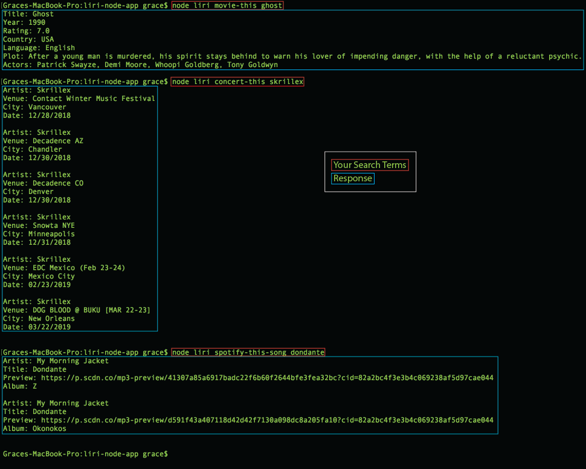

# liri-node-app
LIRI is like iPhone's SIRI. However, while SIRI is a Speech Interpretation and Recognition Interface, LIRI is a Language Interpretation and Recognition Interface. LIRI is a command line node app that takes in parameters and returns data.

### Link to Video Demo:
[Grace's LIRI Homework](https://drive.google.com/file/d/1IHNmciK_k6pkJxi9PHV17rQOPtrZm-VY/view)

### How to use LIRI:
To search for movie/song info or upcoming concerts - type *node liri*, followed by: 
* movie-this *movie title*
* concert-this *musician or band*
* spotify-this-song *song title*
* then press *enter* and bask in your newfound knowledge!

Format: 

